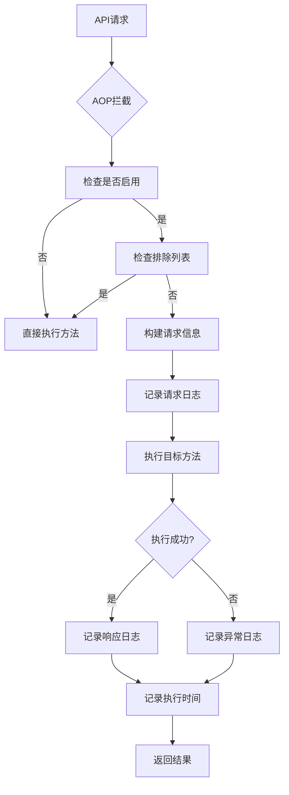

# API日志切面使用说明

## 概述

ApiLogAspect是一个基于Spring AOP的API日志记录切面，用于自动记录Controller方法的请求、响应、执行时间和异常信息。该切面支持自动拦截和配置化控制，无需在每个接口方法上手动添加注解。

## 核心特性

- ✅ **自动拦截**：自动拦截所有Controller方法，无需手动添加注解
- ✅ **配置化控制**：通过配置文件灵活控制日志行为
- ✅ **条件化记录**：支持按包、类、方法级别排除日志记录
- ✅ **敏感信息过滤**：自动过滤密码等敏感参数
- ✅ **性能监控**：记录方法执行时间
- ✅ **异常追踪**：详细记录异常信息

## 架构设计

### 组件关系

```
ApiLogAspect (切面)
    ↓
ApiLogConfig (配置类)
    ↓
application.yml (配置文件)
    ↓
LogTracer (日志追踪工具)
```

### 拦截规则

切面会自动拦截以下类型的方法：

1. **注解拦截**：
   - `@ApiLog` - 自定义注解标记的方法
   - `@RestController` - 所有RestController类的方法
   - `@RequestMapping`/`@GetMapping`/`@PostMapping`等 - HTTP映射注解的方法

2. **包路径拦截**：
   - `com.dailydiscover..controller..*.*(..)` - 所有Controller包下的方法

## 使用流程

### 1. 依赖配置

确保项目已正确引入common模块依赖：

```xml
<dependency>
    <groupId>com.dailydiscover</groupId>
    <artifactId>daily-discover-common</artifactId>
    <version>1.0.0</version>
</dependency>
```

### 2. 启动类配置

在Spring Boot启动类上添加组件扫描和AOP支持：

```java
@SpringBootApplication(scanBasePackages = {"com.dailydiscover.user", "com.dailydiscover.common"})
@EnableAspectJAutoProxy
public class DailyDiscoverUserApplication {
    // ...
}
```

### 3. 配置文件设置

在`application.yml`中添加API日志配置：

```yaml
api:
  log:
    enabled: true                    # 是否启用API日志
    log-request: true               # 是否记录请求参数
    log-response: true              # 是否记录响应结果
    log-execution-time: true        # 是否记录执行时间
    log-exception: true             # 是否记录异常信息
    exclude-packages: ""            # 排除的包路径（逗号分隔）
    exclude-classes: ""             # 排除的类名（逗号分隔）
    exclude-methods: ""             # 排除的方法名（逗号分隔）

logging:
  level:
    com.dailydiscover.common: INFO  # 设置common模块日志级别
```

### 4. 日志输出示例

#### 正常请求日志
```
2025-12-23 20:15:30.123 [http-nio-8091-exec-1] INFO  c.d.c.u.LogTracer - API调用: AuthController.login
请求信息: {
  "URL": "http://localhost:8091/user/api/auth/login",
  "HTTP Method": "POST",
  "IP": "127.0.0.1",
  "Method Parameters": {
    "phone": "13147007732",
    "password": "***"
  }
}

2025-12-23 20:15:30.456 [http-nio-8091-exec-1] INFO  c.d.c.u.LogTracer - API调用: AuthController.login - 响应
响应信息: {
  "success": false,
  "message": "用户不存在",
  "data": null
}

2025-12-23 20:15:30.457 [http-nio-8091-exec-1] INFO  c.d.c.u.LogTracer - 性能监控: AuthController.login
执行时间: 333ms (开始: 20:15:30.123, 结束: 20:15:30.456)
```

#### 异常请求日志
```
2025-12-23 20:15:30.123 [http-nio-8091-exec-1] INFO  c.d.c.u.LogTracer - API调用: AuthController.login
请求信息: {
  "URL": "http://localhost:8091/user/api/auth/login",
  "HTTP Method": "POST",
  "IP": "127.0.0.1",
  "Method Parameters": {
    "phone": "13147007732",
    "password": "***"
  }
}

2025-12-23 20:15:30.234 [http-nio-8091-exec-1] ERROR c.d.c.u.LogTracer - 异常追踪: AuthController.login
异常信息: UserNotFoundException: 用户不存在
请求参数: {"phone": "13147007732", "password": "***"}
堆栈轨迹: ...
```

## 高级配置

### 1. 环境差异化配置

**开发环境** (`application-dev.yml`):
```yaml
api:
  log:
    enabled: true
    log-request: true
    log-response: true
    log-execution-time: true
    log-exception: true
```

**生产环境** (`application-prod.yml`):
```yaml
api:
  log:
    enabled: true
    log-request: false      # 生产环境不记录请求参数
    log-response: false     # 生产环境不记录响应结果
    log-execution-time: true
    log-exception: true
    exclude-packages: "com.dailydiscover.user.controller.health"  # 排除健康检查接口
```

### 2. 排除特定接口

```yaml
api:
  log:
    exclude-packages: "com.dailydiscover.user.controller.health,com.dailydiscover.user.controller.monitor"
    exclude-classes: "com.dailydiscover.user.controller.AuthController"
    exclude-methods: "healthCheck,getSystemInfo"
```

### 3. 自定义注解使用（可选）

如果需要为特定接口提供更详细的日志描述，可以使用`@ApiLog`注解：

```java
@PostMapping("/login")
@ApiLog(value = "用户登录接口", logRequest = true, logResponse = false)
public ResponseEntity<Map<String, Object>> login(@RequestBody LoginRequest request) {
    // ...
}
```

## 实现原理

### 切面执行流程



### 核心方法说明

1. **around()** - 环绕通知核心方法
2. **buildRequestInfo()** - 构建HTTP请求信息
3. **getRequestParams()** - 获取方法参数（含敏感信息过滤）
4. **isExcluded()** - 检查是否在排除列表中
5. **getClientIP()** - 获取客户端真实IP

## 最佳实践

### 1. 性能优化

- 生产环境建议关闭请求/响应参数记录
- 对于高频接口，考虑使用采样率记录
- 使用异步日志记录避免阻塞业务线程

### 2. 安全考虑

- 敏感参数（密码、token等）会自动过滤
- 生产环境建议不记录完整的请求/响应体
- 定期清理日志文件，避免敏感信息泄露

### 3. 监控告警

- 结合ELK等日志系统进行集中管理
- 设置执行时间阈值告警
- 监控异常率变化趋势

## 故障排查

### 1. 日志不生效

**检查项**:
- 确认`api.log.enabled=true`
- 检查启动类是否添加`@EnableAspectJAutoProxy`
- 确认组件扫描包路径包含common模块
- 检查日志级别设置

### 2. 性能问题

**优化建议**:
- 关闭不必要的日志记录
- 使用排除列表过滤监控接口
- 考虑异步日志记录

### 3. 敏感信息泄露

**处理方案**:
- 确认敏感参数过滤生效
- 生产环境关闭详细参数记录
- 定期审计日志内容

## 版本历史

- **v1.0.0** (2024-12-23): 初始版本，支持自动拦截和配置化控制
- **v1.1.0** (2024-12-23): 添加排除功能和敏感信息过滤

## 相关文档

- [Spring AOP官方文档](https://docs.spring.io/spring-framework/docs/current/reference/html/core.html#aop)
- [AspectJ切面编程指南](https://www.eclipse.org/aspectj/doc/released/progguide/index.html)
- [项目日志规范](../logging/日志规范.md)

---

**维护者**: 每日发现开发团队  
**最后更新**: 2024-12-23