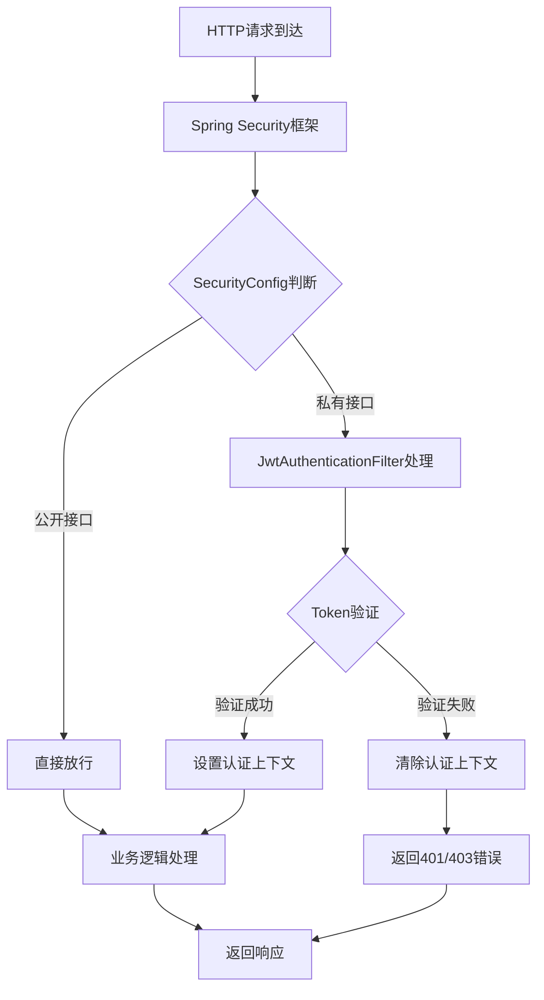

# Spring Security JWT 认证流程说明

## 📋 目录结构
```
config/
├── SecurityConfig.java      # 安全配置（指挥官）
├── JwtAuthenticationFilter.java  # JWT认证过滤器（执行者）
└── 认证流程说明.md          # 本文档
```

## 🎯 核心概念

### 1. 两个文件的分工

| 文件 | 角色 | 职责 | 类比 |
|------|------|------|------|
| **SecurityConfig.java** | 指挥官 | 定义安全策略、配置规则 | 交通规则制定者 |
| **JwtAuthenticationFilter.java** | 执行者 | 具体实现JWT认证逻辑 | 检查站工作人员 |

### 2. 为什么需要两个文件？
- **单一职责原则**：每个文件专注一个功能
- **灵活扩展**：可以独立修改认证方式
- **标准架构**：符合Spring Security最佳实践

## 🔄 认证流程详解

### 完整请求处理流程



### 1. SecurityConfig 的工作（指挥官）

**主要配置项：**
- **接口权限控制**：定义哪些接口需要认证
- **会话管理**：设置为无状态（STATELESS）
- **CORS配置**：支持跨域访问
- **过滤器注册**：将JWT过滤器插入安全链

**关键代码：**
```java
// 注册JWT过滤器
.addFilterBefore(jwtAuthenticationFilter, UsernamePasswordAuthenticationFilter.class)

// 配置接口权限
.requestMatchers("/user/api/debug/health").permitAll()  // 公开接口
.requestMatchers("/user/api/users/me").authenticated()  // 私有接口
```

### 2. JwtAuthenticationFilter 的工作（执行者）

**处理步骤：**
1. **提取Token**：从Authorization头获取Bearer Token
2. **验证Token**：检查Token格式和有效性
3. **解析用户信息**：从Token中提取用户名和权限
4. **设置认证上下文**：创建Authentication对象

**关键代码：**
```java
// 提取Token
String token = authHeader.substring(BEARER_PREFIX.length());

// 验证Token
if (isValidToken(token)) {
    // 设置认证信息
    SecurityContextHolder.getContext().setAuthentication(authentication);
}
```

## 🚀 实际工作示例

### 场景1：访问公开接口（无需认证）
```bash
curl -X GET "http://localhost:8091/user/api/debug/health"
```
**流程：**
1. SecurityConfig识别为公开接口
2. 直接跳过JWT过滤器
3. 执行业务逻辑并返回结果

### 场景2：访问私有接口（需要认证）
```bash
curl -X GET "http://localhost:8091/user/api/users/me" \
     -H "Authorization: Bearer your_jwt_token"
```
**流程：**
1. SecurityConfig识别为私有接口
2. 调用JwtAuthenticationFilter
3. 验证Token有效性
4. 设置用户认证信息
5. 执行业务逻辑

### 场景3：访问私有接口（无Token或Token无效）
```bash
curl -X GET "http://localhost:8091/user/api/users/me"
```
**流程：**
1. SecurityConfig识别为私有接口
2. 调用JwtAuthenticationFilter
3. 发现无Token或Token无效
4. 返回401/403错误

## 🔧 配置要点

### SecurityConfig 关键配置
```java
// 无状态会话（适合JWT）
.sessionCreationPolicy(SessionCreationPolicy.STATELESS)

// 禁用CSRF（REST API不需要）
.csrf(csrf -> csrf.disable())

// 禁用表单登录（使用JWT）
.formLogin(form -> form.disable())
```

### JwtAuthenticationFilter 关键方法
- `doFilterInternal()`：核心认证逻辑
- `isValidToken()`：Token验证
- `extractUsernameFromToken()`：用户信息提取
- `extractAuthoritiesFromToken()`：权限信息提取

## 💡 最佳实践

### 1. 接口分类清晰
- **公开接口**：健康检查、认证相关、公开信息
- **私有接口**：用户个人信息、操作接口、管理接口

### 2. 错误处理完善
- Token过期：返回401
- Token无效：返回401
- 权限不足：返回403

### 3. 安全考虑
- 使用HTTPS传输Token
- 设置合理的Token过期时间
- 定期更换签名密钥

## 🛠️ 扩展建议

### 未来可能的扩展
1. **多因素认证**：在JWT基础上添加二次验证
2. **权限细化**：基于角色的细粒度权限控制
3. **Token刷新机制**：实现无感刷新
4. **审计日志**：记录认证操作

## 📞 问题排查

### 常见问题
1. **403错误**：检查接口权限配置
2. **401错误**：检查Token格式和有效性
3. **CORS错误**：检查跨域配置
4. **会话冲突**：确保配置为无状态

### 调试技巧
- 启用Spring Security调试日志
- 检查过滤器链执行顺序
- 验证Token解析逻辑

---

**总结**：SecurityConfig和JwtAuthenticationFilter是Spring Security JWT认证的两个核心组件，前者制定规则，后者执行认证，两者配合实现安全可靠的认证体系。