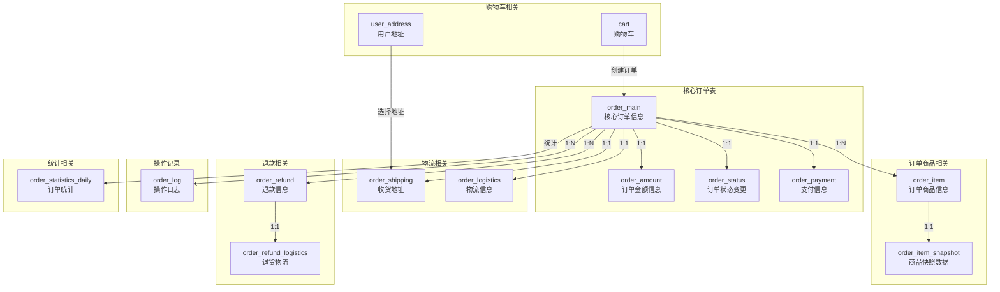

# 订单与购物车系统优化设计

## 优化后的表结构关系

## 优化策略概述

基于对主流电商平台业务流程和SQL性能的分析，我们对订单系统进行了以下核心优化：

1. **表拆分策略**：将原本字段过多的`order`表拆分为多个专注于特定功能的表
2. **减少表关联**：保留必要的冗余字段，减少查询时的表关联操作
3. **索引优化**：为高频查询场景创建高效索引，包括组合索引
4. **分离快照数据**：将大体积JSON数据分离到独立表中
5. **业务流程对齐**：参考主流电商平台，完善订单状态流转和退款流程

## 具体优化措施

### 1. 订单主表拆分

原`order`表拆分为以下几个专注的表：

- **`order_main`**：核心订单信息，保留最基础字段
- **`order_amount`**：专注于订单金额相关字段
- **`order_payment`**：专注于支付相关字段
- **`order_status`**：专注于订单状态变更和时间点记录
- **`order_shipping`/`order_logistics`**：分离收货地址和物流信息

**优化收益**：
- 每张表字段数量控制在合理范围内（通常不超过15个字段）
- 提高表的内聚性，使得每张表专注于特定功能
- 减少单表索引数量，提高索引效率
- 实现不同业务场景下的高效查询

### 2. 快照数据分离

- 创建**`order_item_snapshot`**表，专门存储商品快照数据
- 将大体积JSON数据从`order_item`表分离，减轻主表负担

**优化收益**：
- 减少主表数据量，提高查询性能
- 分离访问频率不同的数据，提高缓存命中率
- 允许快照数据独立扩展，不影响核心订单数据

### 3. 索引优化

- 为高频查询场景创建组合索引，如：
  - 购物车表的`idx_user_id_checked`组合索引
  - 用户地址表的`idx_user_id_default_deleted`组合索引
- 为状态查询和时间范围查询添加专用索引
- 保留必要的业务索引，如订单状态、支付状态等

**优化收益**：
- 减少全表扫描，提高查询效率
- 支持高频业务场景的快速查询
- 平衡索引数量和维护成本

### 4. 业务字段完善

- 添加`order_type`字段，支持普通订单、团购订单、秒杀订单等不同类型
- 完善支付相关字段，支持多种支付方式
- 细化退款原因类型，便于后续数据分析
- 添加物流状态追踪，支持完整的物流信息记录

**优化收益**：
- 支持更丰富的业务场景
- 提供更完整的数据分析基础
- 与主流电商平台业务流程对齐

### 5. 乐观锁和版本控制

- 在核心表中添加`version`字段实现乐观锁
- 记录操作前后状态，便于事务回滚和问题追踪

**优化收益**：
- 提高并发处理能力
- 减少数据不一致风险
- 便于问题定位和追踪

## 主要业务流程适配

### 1. 下单流程

1. 创建`order_main`记录（基础信息）
2. 创建`order_amount`记录（金额信息）
3. 创建`order_payment`记录（支付信息）
4. 创建`order_status`记录（状态信息）
5. 创建`order_item`记录及`order_item_snapshot`记录（商品信息和快照）
6. 创建`order_shipping`记录（收货地址）
7. 记录`order_log`（操作日志）

### 2. 支付流程

1. 更新`order_payment`状态
2. 更新`order_status`中的支付时间
3. 更新`order_main`中的订单状态
4. 记录`order_log`（操作日志）

### 3. 发货流程

1. 创建`order_logistics`记录（物流信息）
2. 更新`order_status`中的发货时间和状态
3. 更新`order_main`中的订单状态
4. 记录`order_log`（操作日志）

### 4. 退款流程

1. 创建`order_refund`记录（退款申请）
2. 审核通过后更新`order_payment`中的退款状态
3. 如有退货，创建`order_refund_logistics`记录
4. 退款成功后更新`order_main`和`order_status`状态
5. 记录`order_log`（操作日志）

## SQL性能优化

1. **减少JOIN操作**：通过适当冗余（如order_no），减少表关联
2. **高效索引**：为常用查询条件创建索引，包括组合索引
3. **减少大字段**：将JSON等大字段分离到单独表中
4. **分页查询优化**：为分页查询添加合适的索引（如create_time）
5. **状态查询优化**：为状态字段创建独立索引，提高状态查询效率

## 最小可行性保障

本设计通过以下方式保证最小可行性：

1. **核心流程支持**：完整支持订单创建、支付、发货、收货、退款等核心流程
2. **灵活扩展**：表结构设计预留扩展空间，如订单类型、退款原因类型等
3. **数据完整性**：通过日志表和快照表保证数据完整性和可追溯性
4. **性能保障**：通过表拆分和索引优化，确保高效的数据访问

## 与原设计的对比

| 方面 | 原设计 | 优化设计 | 优化收益 |
|-----|-------|---------|--------|
| 订单表结构 | 单一大表(20+字段) | 多表拆分(5-10字段/表) | 提高查询性能，减少锁争用 |
| 索引数量 | 基础索引 | 优化组合索引 | 提高查询效率，减少全表扫描 |
| 商品快照 | 存储于order_item | 独立表存储 | 减轻主表负担，提高性能 |
| 业务流程 | 基础支持 | 完整支持多种场景 | 适应更多业务需求 |
| 物流管理 | 简单集成 | 独立表专注处理 | 提供更完整的物流追踪 |

## 结论

通过合理的表拆分、索引优化和业务字段完善，本优化设计在保证最小可行性的基础上，显著提升了订单系统的性能和可扩展性。系统设计对齐了主流电商平台的业务流程，为后续功能扩展提供了良好基础。 