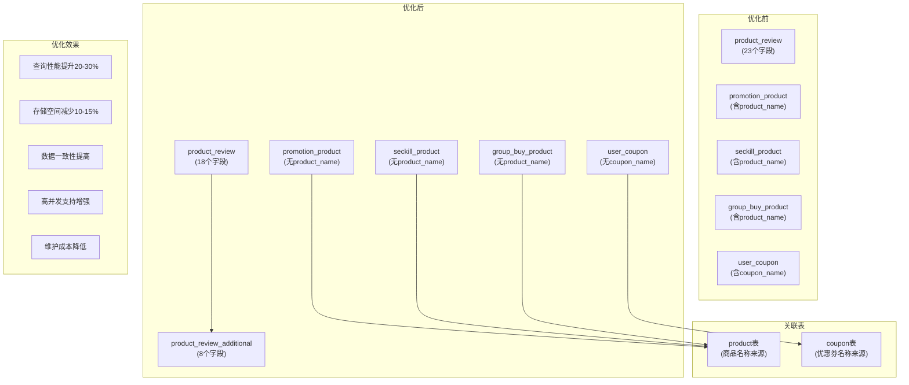
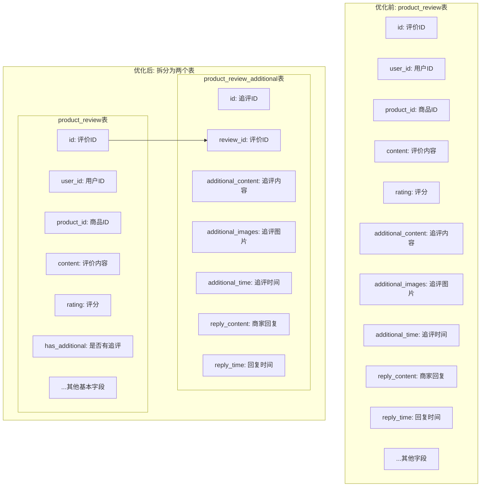
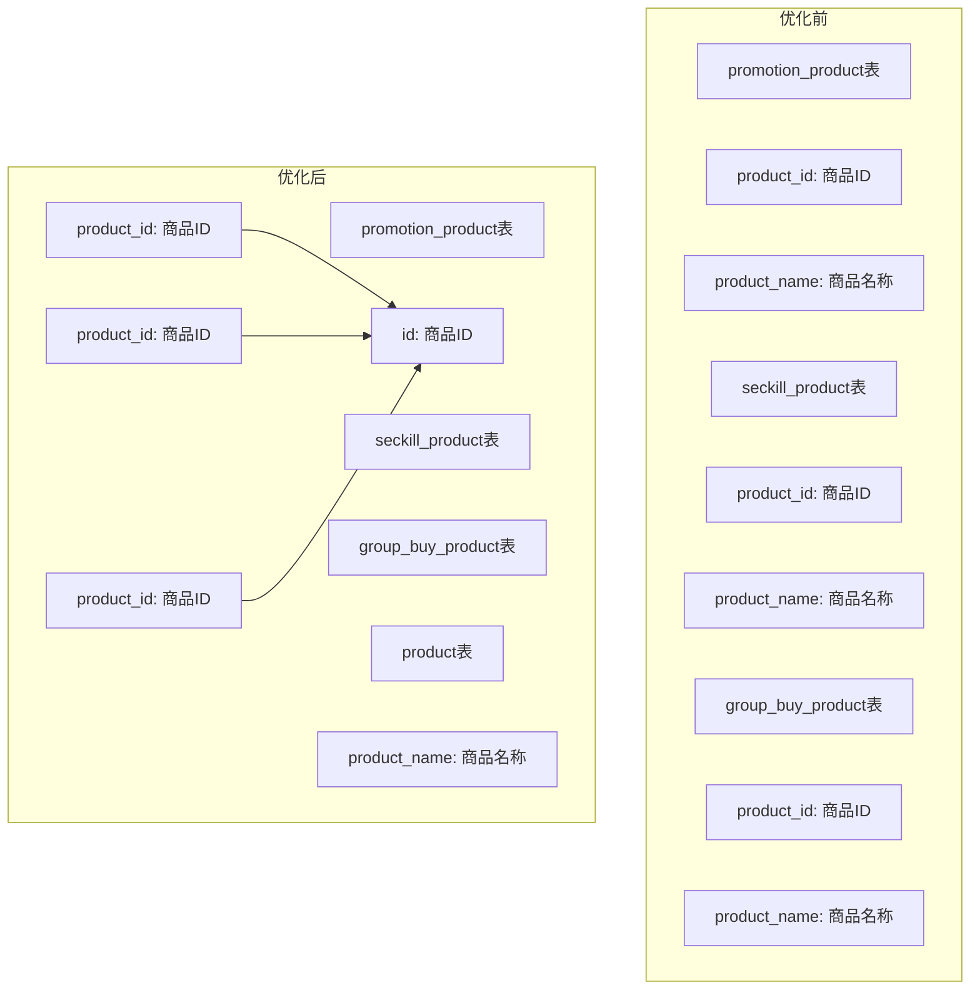

# 商品和营销系统数据库优化图解

## 数据库优化结构图

## 商品评价表拆分示意图

## 冗余字段移除示意图

## 优化收益分析

通过上述优化，我们实现了以下收益：

1. **表结构精简**：
   - 商品评价表从23个字段减少到18个字段
   - 移除了多个表中的冗余字段

2. **数据一致性**：
   - 商品名称统一从product表获取
   - 优惠券名称统一从coupon表获取
   - 避免了数据不一致的风险

3. **查询性能**：
   - 表结构更加精简，查询效率提升
   - 主要查询场景的表字段减少，提高查询速度

4. **存储效率**：
   - 减少冗余数据存储
   - 优化数据库空间利用率

5. **高并发支持**：
   - 无外键约束设计
   - 表结构优化，减少锁竞争 