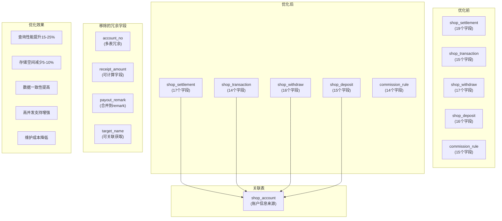
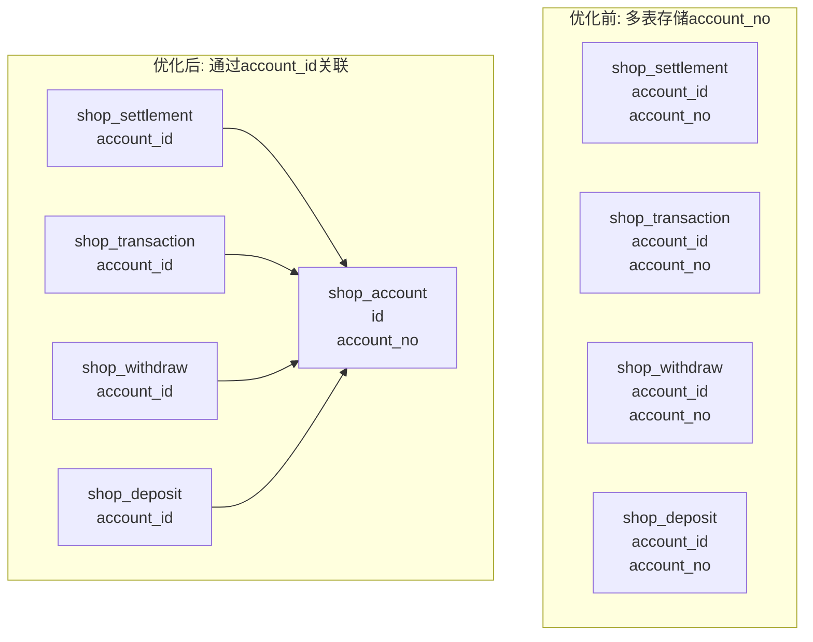
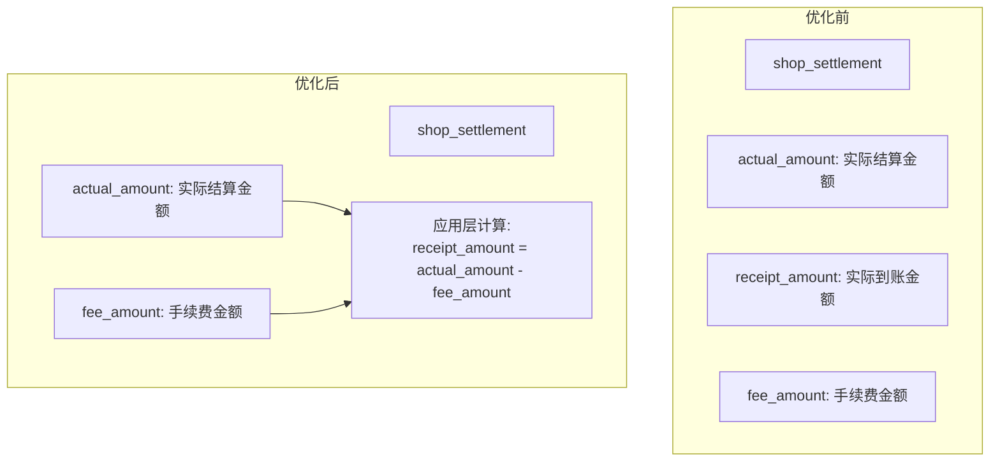
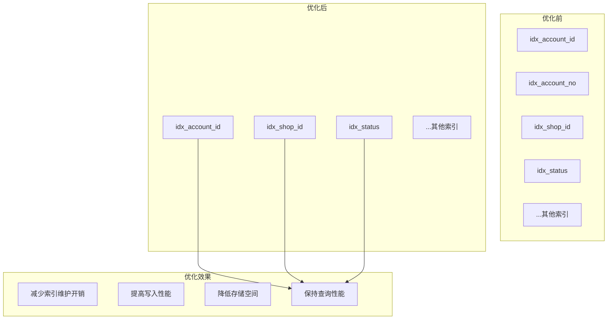

# 店铺财务系统数据库优化图解

## 数据库优化结构图

## 字段冗余移除示意图

## 计算字段优化示意图

## 索引优化示意图

## 优化收益分析

通过上述优化，我们实现了以下收益：

1. **表结构精简**：
   - 店铺结算表从19个字段减少到17个字段
   - 店铺交易流水表从15个字段减少到14个字段
   - 店铺提现申请表从17个字段减少到16个字段
   - 店铺保证金记录表从16个字段减少到15个字段
   - 平台佣金规则表从15个字段减少到14个字段

2. **数据一致性**：
   - 账户编号统一从shop_account表获取
   - 避免了多表存储同一信息导致的数据不一致风险

3. **查询性能**：
   - 表结构更加精简，查询效率提升
   - 索引数量减少，优化了查询计划

4. **存储效率**：
   - 减少冗余数据存储
   - 优化数据库空间利用率

5. **高并发支持**：
   - 无外键约束设计
   - 表结构优化，减少锁竞争 